# Rapid POS AIQ Connector - Version 1.0
Updated 2/16/2026

---

## Overview

The Rapid AIQ Connector syncs customer and transactional data from Counterpoint to AIQ to support targeted email and SMS marketing. AIQ specializes in regulated industries, including firearms.

The connector syncs customer information and sales activity for customers with a populated **Email Address 1** in Counterpoint. If configured, **Phone 1** or **Mobile Phone 1** can also be included to support SMS marketing.

### AIQ Customer Unification

AIQ automatically identifies and unifies customer records that represent the same individual by matching key personally identifiable information (PII), such as email address and phone number. When multiple records share one or more of these identifiers, AIQ merges them into a single **Persona** (master customer profile) rather than treating them as separate contacts.

For example, a customer may make an in-store purchase using a phone number, then later complete an online purchase using an email address. If related identifiers match, AIQ combines the activity into one unified customer profile.

This unification process runs continuously, including overnight processing, to reconcile new data as it is received. If duplicate or overlapping customer data is introduced (such as multiple records sharing the same phone number), AIQ automatically merges those records into a single Persona.

It is important to note that this unification occurs **within AIQ only**. Customer records are not synced back down to Counterpoint, and Counterpoint customer data remains unchanged.

As a result, customer data synced from Counterpoint may be transformed or consolidated by the AIQ platform to improve segmentation, analytics, and marketing effectiveness.
 
For more information, see:
[https://support.alpineiq.com/persona-merging](https://support.alpineiq.com/persona-merging)

---

## Minimum System Requirements

- Minimum Counterpoint version: **8.5.6.2**  
- Minimum SQL Server version: **2016**  
- Minimum Windows Server version: **2016**  
- Minimum PowerShell version: **5.1**  

If you would like the AIQ connector but your system does not meet these minimum requirements, please consult your Care Team Lead (vCIO) for an upgrade quote.

---

## Table of Contents

- [Minimum System Requirements](#minimum-system-requirements)
- [Section 1: AIQ Customer Records](#section-1-aiq-customer-records)
- [Section 2: AIQ Item Records](#section-2-aiq-item-records)
- [Section 3: AIQ Configuration](#section-3-aiq-configuration)
- [Section 4: AIQ Account Store Mapping](#section-4-aiq-account-store-mapping)
- [Section 5: AIQ Field Mapping Customers Up](#section-5-aiq-field-mapping-customers-up)
- [Section 6: AIQ Field Mapping Items Up](#section-6-aiq-field-mapping-items-up)
- [Section 7: AIQ Field Mapping Documents Up](#section-7-aiq-field-mapping-documents-up)
- [Section 8: AIQ Customer Status View](#section-8-aiq-customer-status-view)
- [Section 9: AIQ Item Status View](#section-9-aiq-item-status-view)
- [Section 10: AIQ Documents Queue](#section-10-aiq-documents-queue)
- [Section 11: AIQ Items Quantity on Hand View](#section-11-aiq-items-quantity-on-hand-view)
- [Section 12: Run AIQ Connector Button](#section-12-run-aiq-connector-button)
- [Section 13: Mark All AIQ Messages as Read](#section-13-mark-all-aiq-messages-as-read)
- [Section 14: AIQ Connector Execution and Sync Timing](#section-14-aiq-connector-execution-and-sync-timing)
- [Section 15: Managing Customer Email and Phone Updates](#section-15-managing-customer-email-and-phone-updates)
- [Conclusion](#conclusion)

---

## SECTION 1: AIQ Customer Records

The AIQ Connector adds an **AIQ Customers** button within Counterpoint, providing access to AIQ-specific customer fields directly from the Counterpoint customer record.

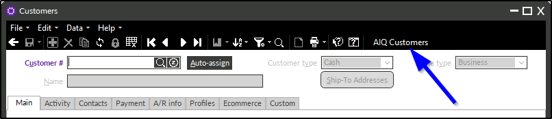

The email address on the AIQ customer record is populated from **Email Address 1** on the Counterpoint customer record.

Depending on configuration, the phone number is populated from either **Phone 1** or **Mobile Phone 1** on the Counterpoint customer record, **only when it meets the following criteria**:
- Contains **exactly 10 numeric digits**
- Does **not** include letters 

If the configured phone number field contains more than or fewer than 10 digits, or if it includes letters, the number will **not** be pushed to AIQ.

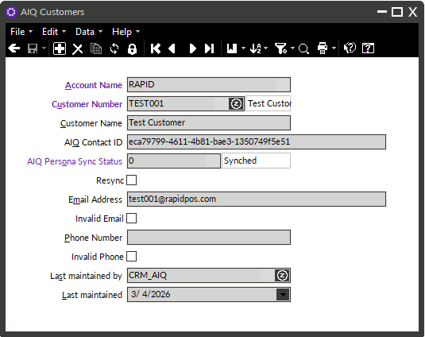

When an AIQ customer record is created or updated in Counterpoint, it is flagged for synchronization. The customer sync process runs once daily according to the configured **Daily Event Execution Time** (default 10:00 PM).

After the data is received, the AIQ platform processes the update independently, and changes may take up to one day to become visible within AIQ, depending on AIQ processing timelines. 

### Accessing AIQ Customer Records

All AIQ customer records can also be accessed from:

**Connectors > AIQ > AIQ Customers**

This view allows records to be displayed in **table view**, where filters can be applied to review customers based on their current sync status.

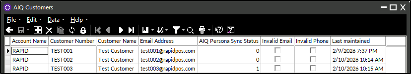

### AIQ Sync Status Codes

Each AIQ customer record includes a sync status value indicating its current state in the sync process:

- **0** – Fully synced; nothing pending  
- **1** – Recently created or updated; will sync on the next connector run  
- **2** – Customer is currently in the active sync queue  
- **5** – Invalid email address  
- **6** – Invalid phone number  
- **9** – Sync error; requires remediation before it can be re-synced  

---

## SECTION 2: AIQ Item Records

The AIQ Connector syncs item and inventory record data from Counterpoint to AIQ to support transactional data and product-specific marketing initiatives. 

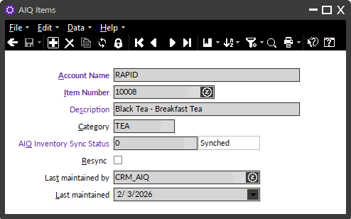

Following ticket posting, AIQ item records are automatically created in Counterpoint for any items that do not yet have an associated AIQ item record. At the same time, existing AIQ item records are flagged for synchronization. 

**Note:** Items are only synced to AIQ after they are associated with a posted ticket. AIQ requires items to have sales data before they appear in the **My Analytics** section.

When an AIQ item record is created or updated in Counterpoint (or it is present on a recently posted ticket), it is flagged for synchronization. The item sync process runs once daily according to the configured **Item Sync Event Execution Time** (default 10:00 PM).

After the data is received, the AIQ platform processes the update independently, and changes may take up to one day to become visible within AIQ, depending on AIQ processing timelines. 

The quantity value sent to AIQ represents the **quantity on hand**. For clients with multiple inventory locations in Counterpoint, the **CRM_AIQ location group** determines which locations are included when calculating quantity on hand. Quantities from the included locations are summed and sent to AIQ.

**Note:** AIQ does not currently support location-level inventory quantities, so a summed quantity is provided instead.

### Accessing AIQ Item Records

All AIQ item records can be accessed from:

**Connectors > AIQ > AIQ Items**

This view allows records to be displayed in **table view**, where filters can be applied to review items based on their current sync status.

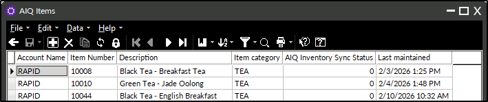

### AIQ Sync Status Codes

Each AIQ item record includes a sync status value indicating its current state in the sync process:

- **0** – Fully synced; nothing pending  
- **1** – Recently created or updated; will sync on the next connector run  
- **2** – Item is currently in the active sync queue  
- **9** – Sync error; requires remediation before it can be re-synced

### Item Merge

When two items are merged in Counterpoint, the connector notifies AIQ of the merge using the `createUpdateSale` endpoint, after which AIQ processes the related product and sale data according to its own logic.

---

## SECTION 3: AIQ Configuration

The AIQ Connector includes a user interface for managing configuration options that control how the connector interacts with AIQ and Counterpoint.  

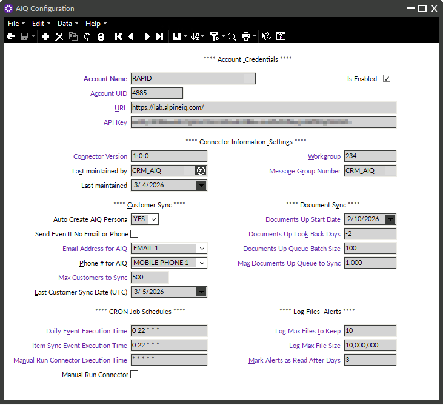

For clients who use **multiple AIQ accounts**, a separate configuration record will exist for each account.

### Account Name, Account UID, URL, API Key, and API Revision
- Identifies the AIQ account and its associated credentials.
- Especially important for companies with more than one AIQ account (for example, separate accounts for a retail store and a restaurant).

### Is Enabled?
- Used to temporarily disable the connector while troubleshooting or testing.

### Connector Version, Last Maintained By, Last Maintained
- Displays the current connector version and the most recent maintenance information for reference.

### Workgroup
- Customer activity sometimes requires a defined workgroup. If needed, this connector will use workgroup **234**, which is created during the installation process.

### Message Group ID
- Defines the Message Group ID (`MAIL_GRP_ID`) used for AIQ connector alert messages in Counterpoint.
- When an error or issue is encountered, alerts are sent to the Counterpoint users associated with this message group.
- It is recommended to assign 1–3 users to receive these alerts.
- Note: This value must reference a valid Message Group containing the appropriate Counterpoint User ID values.

### Auto Create AIQ Persona
Controls when AIQ customer records are automatically created in Counterpoint.

**EMAIL ONLY**  
- An AIQ customer record is automatically created when a customer is added to Counterpoint with **Email Address 1**.  
- If the configured phone number (**Mobile Phone 1** or **Phone 1**) is also present and valid, it will be included on the AIQ Persona.

**NO**  
- AIQ customer records must be created manually.

### Phone # for AIQ
- Defines which Counterpoint Customer Record phone number field is used to populate the AIQ **Phone Number** persona property.
- Supported options: **Mobile Phone 1** or **Phone 1**
- If the selected phone field does not meet the _exactly 10 numeric digits_ requirement, the phone number will not be sent to AIQ

### Last Customer Sync Date (UTC)
- Displays the most recent date a customer record was successfully synced to AIQ.

### Max Customers to Sync
- Used to optimize connector performance.
- Defines the maximum number of customers that can be synced in a single connector run.

### Documents Up Start Date
- Used to limit the furthest historical date from which documents will sync.
- Also enables syncing of previously posted (historical) tickets to AIQ during initial connector setup.

### Documents Up Look Back Days
- Each connector run checks for documents that have not yet synced, going back the specified number of days.
- Ensures documents sync after a power outage or temporary connector interruption.
- Regardless of this setting, the **Documents Up Start Date** is always respected as the absolute limit.

### Documents Up Queue Batch Size _(Acts as the maximum documents allowed per run)_
- Used to optimize connector performance.
- Defines the **maximum total number of documents** that the connector is allowed to sync from the Documents Up queue during a single connector execution.
- Although labeled as a “batch size,” this value functions as a **hard ceiling** on how many documents may be synced in one run. Once this limit is reached, no additional documents are processed until the next scheduled execution.
- This setting is used to prevent large backlogs from syncing all at once, control connector runtime and avoid AIQ API rate limiting.

### Max Documents Up Queue to Sync _(Acts as the per-batch processing size)_
- Used to optimize connector performance.
- Defines the **number of documents processed at a time** when syncing documents from the **AIQ Documents Queue**.
- During a single connector run, documents are processed in batches using this value. As the run progresses, the connector dynamically adjusts the final batch size to ensure that the total number of documents synced does not exceed the Documents Up Queue Batch Size limit.
- For example:
  - If the batch size is 100 and the maximum allowed is 500, the connector will process up to five batches.
  - If fewer than 100 documents remain before reaching the maximum, the final batch will be reduced accordingly.
- Works in conjunction with **Documents Up Queue Batch Size**
  - During each connector execution, the connector tracks how many documents have already been synced in the current run.
  - Before processing each batch, it evaluates how many documents remain before reaching the maximum allowed.
  - The batch size is dynamically reduced if needed so the connector never exceeds the configured maximum.
- Important: The Documents Up Queue Batch Size value should be greater than or equal to the Max Documents Up Queue to Sync value to ensure predictable batching behavior.

### Retain Queue Days
- The number of days that documents are retained in the queue for troubleshooting purposes. 

### Other Configuration Options
Additional configuration fields exist for internal use by Rapid programmers. These options are used to optimize performance or assist with troubleshooting and should not be modified by end users.

---

## SECTION 4: AIQ Account Store Mapping

The **AIQ Account Store Mapping** feature controls which Counterpoint store locations are included when sending ticket history (document) data to AIQ for a specific AIQ account. Only ticket history data from mapped stores is eligible to be queued and synced to AIQ.

Each record in the AIQ Account Store Mapping table links:

- An **AIQ Account**
- A **Counterpoint Store ID**

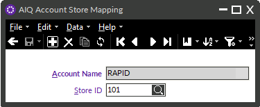

When the connector processes posted tickets:

- The store associated with each ticket is evaluated.
- Only tickets from Counterpoint Store IDs that are mapped to the corresponding AIQ account are included in the Documents Up sync process.
- Tickets from stores that are **not mapped** are ignored and will not be sent to AIQ.

This allows precise control over which store locations contribute transactional data to each AIQ account.

---

## SECTION 5: AIQ Field Mapping Customers Up

The **AIQ Field Mapping Customers Up** screen provides a user interface for managing which customer fields are sent from Counterpoint up to AIQ.

This table defines how customer record data in Counterpoint maps to AIQ Persona properties. The standard deployment includes a predefined set of fields that are automatically synced. Adjustments to this table should generally be performed by a programmer.

Note: This is best viewed in _table view_.

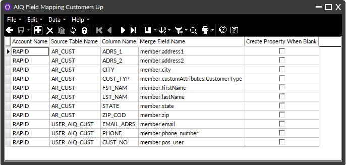

Calculated fields are not included by default. Any request to add calculated fields must be reviewed and quoted separately by Rapid.

**Note:** **Email Address 1** is a required field and must be sent to AIQ.

### Standard Customer Record Fields Sent to AIQ

The following customer fields are included in a standard AIQ connector deployment:

1. Email Address  
2. Phone
3. Customer Number
4. First Name  
5. Last Name  
6. Address 1  
7. Address 2  
8. City  
9. State  
10. Zip Code  
11. Country  
12. A/R Balance  
13. Customer Category  
14. First Sale Date  
15. Last Sale Date  
16. Loyalty Point Balance  

Note: The AIQ Connector currently supports **customers up** only. Customer records can be pushed from Counterpoint to AIQ, but customers cannot be downloaded (imported) from AIQ into Counterpoint.

---

## SECTION 6: AIQ Field Mapping Items Up

The **AIQ Field Mapping Items Up** screen provides a user interface for managing which item and inventory fields are sent from Counterpoint up to AIQ.

This table defines how item record data in Counterpoint maps to AIQ product fields. The standard deployment includes a predefined set of fields that are automatically synced. Adjustments to this table should generally be performed by a programmer.

Note: This is best viewed in _table view_.

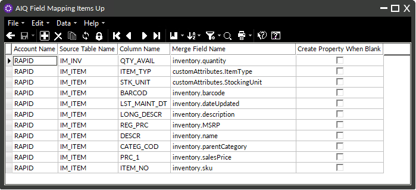

Calculated fields are not included by default. Any request to add calculated fields must be reviewed and quoted separately by Rapid.

### Standard Item Record Fields Sent to AIQ

The following item and inventory fields are included in a standard AIQ connector deployment:

1. Item Number
2. Description
3. Long Description
4. Item Type  
5. Price 1 
6. Regular Price
7. Stocking Unit
8. Category Code
9. Vendor Number 
10. Barcode 
11. Quantity  
12. Last Maintained Date

---

## SECTION 7: AIQ Field Mapping Documents Up

The **AIQ Field Mapping Documents Up** screen provides a user interface for managing which document (posted ticket) fields are sent from Counterpoint up to AIQ.

This table defines how document data in Counterpoint maps to AIQ sale history fields. The standard deployment includes a predefined set of fields that are automatically synced. Adjustments to this table should generally be performed by a programmer.

Note: This is best viewed in _table view_.

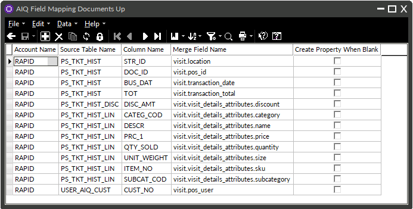

Calculated fields are not included by default. Any request to add calculated fields must be reviewed and quoted separately by Rapid.

### Standard Document Fields Sent to AIQ

The following document fields are included in a standard AIQ connector deployment:

#### Ticket History Header Data
1. Document ID
2. Store ID
3. Business Date
4. Customer Number
5. Discount Amount
6. Total

#### Ticket History Line Data
1. Item Numbers
2. Descriptions
3. Prices
4. Category Codes
5. Subcategory Codes
6. Weights
7. Quantities Sold

#### Document Sync Schedule

Following ticket posting, AIQ item records are automatically added to a queue to be synced to AIQ. The document sync process runs once daily according to the configured **Daily Event Execution Time** (default 10:00 PM).

After the data is received, the AIQ platform processes the sale independently, and changes may take up to one day to become visible within AIQ, depending on AIQ processing timelines. 

---

## SECTION 8: AIQ Customer Status View

Each AIQ customer record includes a **sync status** that indicates its current state in the connector process. In some cases, it is helpful to review how many customer records fall into a particular status category.

For example, you may want to identify that **43 customers have an invalid email address (status 5)** so those records can be reviewed and corrected.

The **AIQ Customer Status View** displays a summary table showing:
- Each sync status code (0, 1, 2, 5, 6, 9)
- The total number of customer records currently associated with that status

**Notes:**
- If no customer records exist for a given status, that status will **not** appear in the table.
- The table can be refreshed at any time to display the most up-to-date information.
- This is best viewed in _table view_.

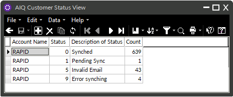

For details on the meaning of each customer sync status value, refer back to **SECTION 1: AIQ Customer Records**.

---

## SECTION 9: AIQ Item Status View

Each AIQ item record includes a **sync status** that indicates its current state in the connector process. In some cases, it is helpful to review how many item records fall into a particular status category.

For example, you may want to identify that an item has encountered an error (status 9) so that record can be reviewed and remediated.

The **AIQ Item Status View** displays a summary table showing:
- Each sync status code (0, 1, 2, 9)
- The total number of item records currently associated with that status

**Notes:**
- If no item records exist for a given status, that status will **not** appear in the table.
- The table can be refreshed at any time to display the most up-to-date information.
- This is best viewed in _table view_.

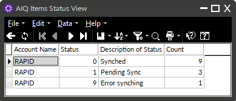

For details on the meaning of each item sync status value, refer back to **SECTION 2: AIQ Item Records**.

---

## Section 10: AIQ Documents Queue

When sending document data to AIQ, each posted ticket is first placed into a queue in Counterpoint. Tickets are then synced from this queue to AIQ on the next run of the connector.

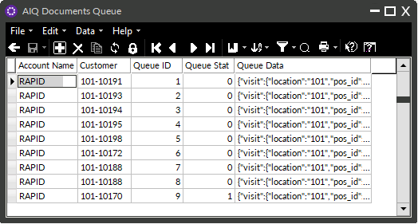

### Queue Status Values

Each document in the queue includes a status value indicating its current state in the sync process:

- **0** – Document has already been synced to AIQ; nothing pending  
- **1** – Document has been recently created or updated and will be added to the queue on the next connector run  
- **2** – Document is currently in the active sync queue  
- **9** – Document encountered an error and requires remediation before it can be re-synced

---

## Section 11: AIQ Items Quantity on Hand View

The **AIQ Items Quantity on Hand View** displays the current summed **quantity on hand** for each item that has an AIQ item record in Counterpoint.

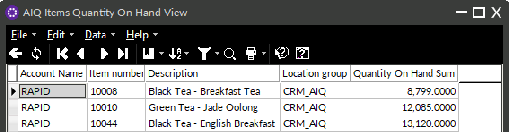

For clients with multiple inventory locations in Counterpoint, the **CRM_AIQ location group** determines which locations are included when calculating the **total** quantity on hand. Quantities from the included locations are aggregated and displayed in this view.

In Counterpoint, **quantity on hand** is updated only when specific transactions are posted. These transactions include posting a ticket, posting a receiver, posting an inventory adjustment, posting a transfer out, and posting a physical count.

**Note:** AIQ does not currently support location-level inventory quantities, so a summed quantity is provided instead.

---

## SECTION 12: Run AIQ Connector Button

The **Run AIQ Connector** menu option allows authorized users to manually trigger the AIQ Connector when needed. Manual execution is typically used for testing or troubleshooting and is not required during normal operation.

### How Manual Execution Works

When the **Run AIQ Connector** menu option is selected:

- A **Manual Run Connector** action flag is set in the AIQ configuration.
- The flag functions as a **one-time execution request** and remains enabled until it is processed by the connector.
- Execution is handled in the background on the server (not on the workstation) to prevent overlapping executions.
- During a manual run, the configured **Daily Event Execution Time** and **Item Sync Event Execution Time** schedules are bypassed. Instead, customer changes, item changes, and posted tickets currently in the queue are synced immediately.

### Background Processing and Scheduling

A background process periodically checks for the **Manual Run Connector** action flag based on a configurable **CRON schedule** stored in the AIQ configuration.

- The **Manual Run Connector Execution Time** schedule can be configured from the **AIQ Configuration** screen.
- When the action flag is detected:
  - If the AIQ connector is **not currently running**, it will execute for **all configured AIQ accounts**, typically within one minute.
  - If the connector **is already running**, the system waits for the current execution to complete, then automatically restarts the connector for all configured AIQ accounts.

In both scenarios, the action flag is **automatically cleared** when execution begins.

**Important:** Manual execution is intended primarily for **programmer-led testing or troubleshooting**, often when the connector has been **temporarily disabled**. It is not designed for routine operational use, as the connector runs automatically according to its configured schedule.

---

## SECTION 13: Mark All AIQ Messages as Read

The **Mark All AIQ Messages as Read** menu option allows users to suppress repeated pop-up alerts in Counterpoint while retaining all AIQ connector messages for later review.

This is especially useful in scenarios such as:
- Repeated error messages following a temporary internet outage
- High-volume alert conditions that have already been reviewed or acknowledged

Marking messages as read stops the pop-up notifications but does **not** delete the messages. All connector messages remain accessible in Counterpoint and can be reviewed at any time.

---

## SECTION 14: AIQ Connector Execution and Sync Timing

The AIQ Connector operates as a **Windows Service**, automatically syncing customer personas, item and inventory data, and transactional documents between Counterpoint and AIQ.

The connector runs in the background and processes different types of data on **separate schedules**, following recommendations from the AIQ platform to optimize performance and API usage.

### Daily Event Execution Time
The following data is synced **once per day** according to the configured **Daily Event Execution Time** (default **10:00 PM**):
- Customers
- Posted tickets

### Item Sync Event Execution Time
Item and inventory data is synced **once per day** according to the configured **Item Sync Event Execution Time** (default **10:00 PM**):

---

## SECTION 15: Managing Customer Email and Phone Updates

When a customer is synced to AIQ, the connector stores the associated **AIQ Persona ID** on the AIQ Customer record in Counterpoint. The AIQ platform processes data from multiple sources and may consolidate or reassign personas over time. If AIQ updates the Persona ID associated with a given email address, the connector updates the stored Persona ID in Counterpoint for the corresponding AIQ Customer record.

### Updating Email Address and Phone Number

If **Email Address 1** or the configured phone number (**Mobile Phone 1** or **Phone 1**) is updated in Counterpoint for a customer who already has an AIQ profile:

- The connector sends the updated email address or phone number to AIQ along with the full customer record.
- AIQ evaluates the updated data and applies its own consolidation logic, which may result in profile updates or persona merging within AIQ.

Counterpoint customer records are not modified as part of this process.

### Handling Duplicate Customer Records

AIQ consolidates persona data from multiple systems, including POS and ecommerce platforms. Because of this, the connector allows multiple Counterpoint customers to share the same email address and/or phone number.

When duplicate identifiers are sent to AIQ:

- The connector sends the data as provided by Counterpoint.
- AIQ determines whether the records should be associated with the same Persona or treated as separate personas based on its internal matching rules.

This consolidation occurs entirely within AIQ.

### Handling Merged Customers in Counterpoint

When two customer records are merged in Counterpoint:

- The AIQ customer record associated with the **“To”** customer (the retained record) remains linked to the AIQ Persona.
- If the **“From”** customer had an associated AIQ customer record, that record becomes detached from any active customer.
- The connector notifies AIQ of the merge using the `createUpdateSale` endpoint, after which AIQ processes the persona data according to its own logic.

It is recommended to **manually delete** the detached AIQ Customer record after the merge. Otherwise, it will remain in Counterpoint without an active association to an AIQ Persona.

---

## Conclusion

The Rapid AIQ Connector streamlines the exchange of customer and transactional data between Counterpoint and AIQ, enabling powerful email and SMS marketing. 
  
Before go-live, review configuration settings and field mappings. After deployment, monitor customer, item and document sync statuses to identify invalid records requiring remediation. 
  
For assistance with configuration changes, field mapping, or troubleshooting, contact Rapid Support. 
  
